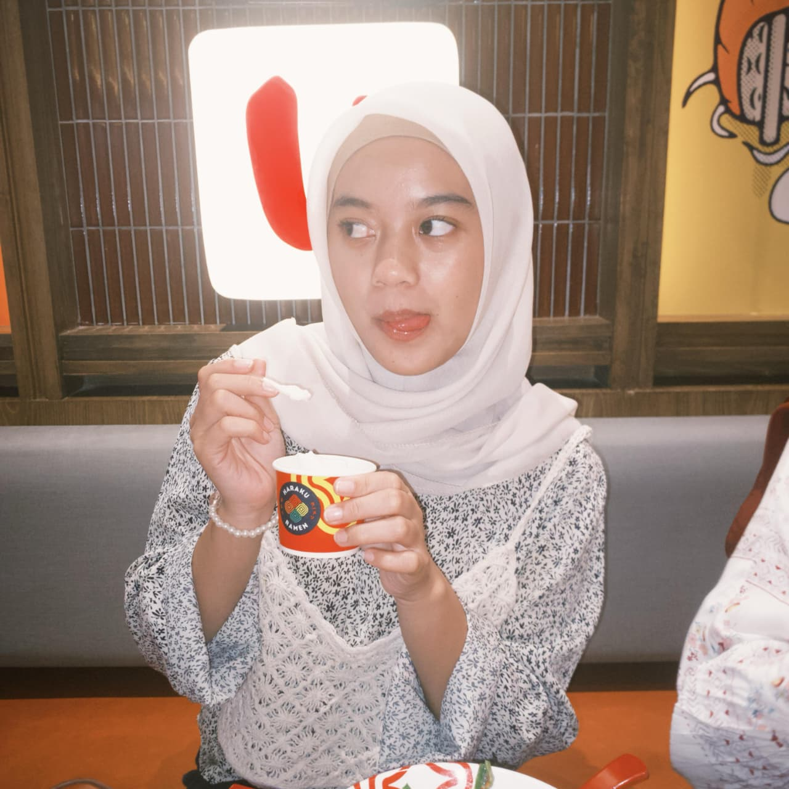
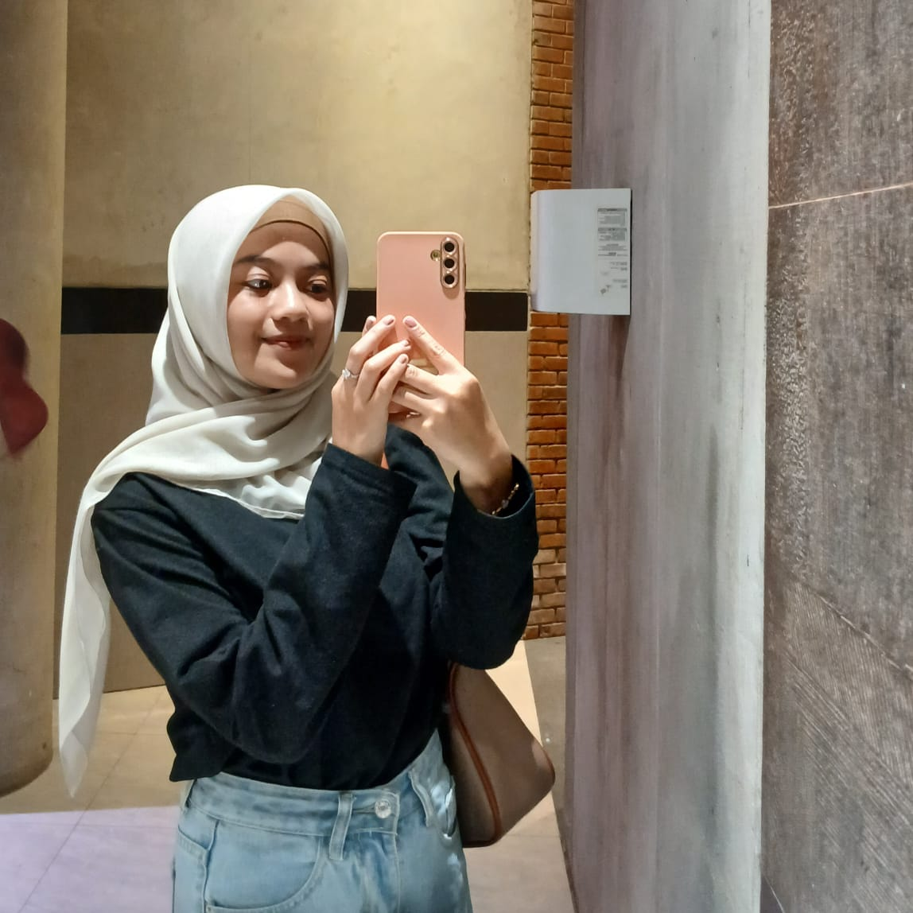

# 📌 Analisis Kode Portofolio Tika

## 1. Struktur Dasar HTML
```
html
<!DOCTYPE html>
<html lang="id">
<head>
  <meta charset="UTF-8">
  <title>Portofolio Tika</title>
  <style>
    /* CSS ditulis di sini */
  </style>
</head>
```
Blok ini adalah kerangka utama dokumen HTML.
<!DOCTYPE html> mendeklarasikan standar HTML5. Tag <html lang="id"> menandakan bahasa utama dokumen adalah bahasa Indonesia. Di dalam <head>, terdapat <meta charset="UTF-8"> agar semua karakter bisa terbaca. <title> menampilkan judul tab browser, sedangkan <style> menampung aturan CSS internal.
```
* {
  margin: 0;
  padding: 0;
  box-sizing: border-box;
  font-family: Arial, sans-serif;
}

body {
  background: linear-gradient(135deg, #f5c7ce, #f7e3e7);
  display: flex;
  justify-content: center;
  align-items: center;
  min-height: 100vh;
}
```
Selector * dipakai untuk reset CSS agar konsisten. Pada body, latar belakang diberi gradien pink lembut dan diatur dengan flexbox supaya .container berada di tengah layar.
```
.container {
  width: 85%;
  max-width: 1100px;
  background: white;
  border-radius: 16px;
  box-shadow: 0 8px 20px rgba(0,0,0,0.25);
  overflow: hidden;
  display: flex;
  flex-direction: column;
}
```
.container membungkus seluruh isi web. Ukurannya fleksibel dengan max-width agar nyaman di semua layar. Warna putih, sudut membulat, dan bayangan memberi kesan modern.
```
<nav>
  <div class="logo">Portofolio Tika</div>
  <ul>
    <li><a href="#" onclick="showSection('home')">Home</a></li>
    <li><a href="#" onclick="showSection('about')">About Me</a></li>
    <li><a href="#" onclick="showSection('funfact')">Fun Fact</a></li>
    <li><a href="#" onclick="showSection('gallery')">Galeri</a></li>
    <li><a href="#" onclick="showSection('contact')">Contact</a></li>
  </ul>
</nav>
```
```
nav {
  display: flex;
  justify-content: space-between;
  align-items: center;
  background: #f7e3e7;
  padding: 15px 40px;
  border-bottom: 3px solid #f5c7ce;
}

nav .logo {
  font-size: 20px;
  font-weight: bold;
  color: #d96c91;
}

nav ul {
  list-style: none;
  display: flex;
  gap: 25px;
}
```
Navigasi memuat logo dan menu horizontal. Flexbox menjaga posisi logo di kiri dan menu di kanan. Link diberi efek hover: warna berubah pink dan muncul garis animasi bawah.
```
.content {
  padding: 40px;
  flex: 1;
}

.section {
  display: none;
  animation: fadeIn 0.6s ease;
}
.active {
  display: block;
}

@keyframes fadeIn {
  from {opacity: 0; transform: translateY(10px);}
  to {opacity: 1; transform: translateY(0);}
}
```
Konten diatur dalam .content. Masing-masing .section hanya muncul saat memiliki class .active. Animasi fadeIn membuat pergantian antar section lebih halus.
```
<div id="home" class="section active">
  <h2>Selamat Datang 👋</h2>
  <p>Selamat datang di portofolio pribadi saya...</p>
</div>
```
Halaman awal dengan sambutan singkat. Default aktif dengan class .active.
```
<div id="about" class="section">
  <div class="about-container">
    
    <div class="about-text">
      <h2>Tentang Saya</h2>
      <p>Perkenalkan, nama saya <b>Hartika Ansar</b> ...</p>
    </div>
  </div>
</div>
```
Menampilkan foto dan teks dalam grid. Foto diberi border pink, bayangan, serta efek zoom saat hover. Teks rapi dengan text-align: justify.
```
<div id="funfact" class="section">
  <h2>Fun Fact ✨</h2>
  <p>Di sela-sela kesibukan akademik...</p>
  <p>Saya juga memiliki impian...</p>
</div>
```
Fakta unik tentang penulis, ditata di tengah halaman dengan teks rapi.
```
<div id="gallery" class="section">
  <h2>Galeri 📸</h2>
  <button class="btn-gallery" onclick="toggleGallery()">Lihat Galeri</button>
  <div id="galleryGrid" class="gallery-grid">
    
    
  </div>
</div>
```
Galeri foto ditampilkan dengan tombol. Menggunakan grid responsif dengan efek hover.
```
<div id="contact" class="section">
  <h2>Kontak</h2>
  <div class="contact-links">
    <a href="https://wa.me/62822..." target="_blank">WhatsApp</a>
    <a href="https://instagram.com/..." target="_blank">Instagram</a>
  </div>
</div>
```
Link ke platform sosial ditampilkan sebagai tombol bulat dengan warna pink. Saat hover berubah warna dan sedikit naik.


