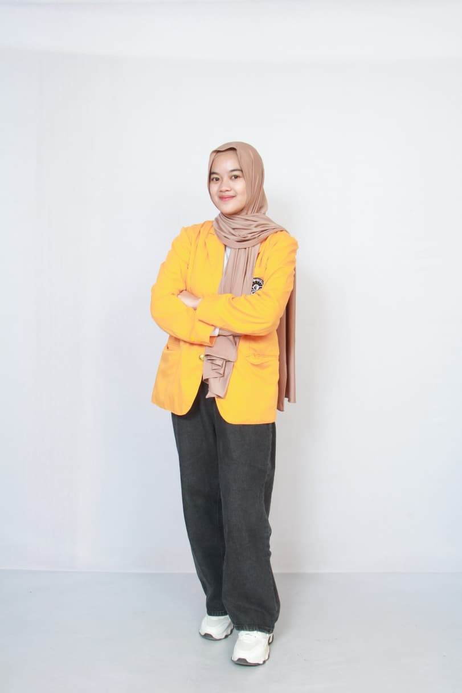

``<!DOCTYPE html>
<html lang="id">
<head>
  <meta charset="UTF-8">
  <title>Portofolio Tika</title>
  
</head``
Blok pertama adalah struktur kerangka dokumen. <!DOCTYPE html> menyatakan bahwa halaman ini menggunakan standar HTML5. Elemen <html lang="id"> mendefinisikan bahasa Indonesia untuk isi dokumen. Pada <head>, terdapat <meta charset="UTF-8"> untuk mendukung karakter Unicode, <title> untuk judul tab browser, serta <style> yang berisi seluruh aturan CSS internal. Dengan struktur ini, halaman bisa dibaca dan ditampilkan dengan benar oleh browser.
* {
  margin: 0;
  padding: 0;
  box-sizing: border-box;
  font-family: Arial, sans-serif;
}

body {
  background: linear-gradient(135deg, #f5c7ce, #f7e3e7);
  display: flex;
  justify-content: center;
  align-items: center;
  min-height: 100vh;
}
Blok CSS global mengatur reset pada semua elemen menggunakan selector *, agar margin dan padding default dihilangkan serta ukuran dihitung dengan border-box. Font bawaan seluruh halaman menggunakan Arial. Pada body, diberikan gradien pink lembut sebagai latar belakang, lalu digunakan flexbox untuk memusatkan konten .container secara vertikal dan horizontal dengan tinggi penuh layar.
.container {
  width: 85%;
  max-width: 1100px;
  background: white;
  border-radius: 16px;
  box-shadow: 0 8px 20px rgba(0,0,0,0.25);
  overflow: hidden;
  display: flex;
  flex-direction: column;
}
Bagian container adalah pembungkus utama seluruh konten. Container dibuat fleksibel dengan lebar 85% namun tidak lebih dari 1100px. Warna latar putih memberi kontras, sudut dibuat membulat dengan border-radius, dan bayangan (box-shadow) menambah kesan elegan. Container juga menggunakan flex column agar isi diatur dari atas ke bawah.
<nav>
  
Portofolio Tika

  <ul>
    <li><a href="#" onclick="showSection('home')">Home</a></li>
    <li><a href="#" onclick="showSection('about')">About Me</a></li>
    <li><a href="#" onclick="showSection('funfact')">Fun Fact</a></li>
    <li><a href="#" onclick="showSection('gallery')">Galeri</a></li>
    <li><a href="#" onclick="showSection('contact')">Contact</a></li>
  </ul>
</nav>
Navbar memuat logo di kiri dan menu navigasi di kanan. CSS mengatur nav menggunakan flex dengan padding nyaman serta garis bawah dekoratif. Logo diberi warna pink agar mencolok. Daftar menu (ul li a) diberi efek hover dengan perubahan warna dan animasi garis bawah menggunakan pseudo-element ::after.
.content {
  padding: 40px;
  flex: 1;
}

.section {
  display: none;
  animation: fadeIn 0.6s ease;
}

.active {
  display: block;
}

@keyframes fadeIn {
  from {opacity: 0; transform: translateY(10px);}
  to {opacity: 1; transform: translateY(0);}
}
Semua konten ditempatkan dalam div .content. Masing-masing section awalnya disembunyikan (display: none), lalu hanya section dengan class .active yang terlihat. Animasi fadeIn membuat transisi muncul lebih halus dengan perubahan opacity dan posisi.

  <h2>Selamat Datang 👋</h2>
  
Selamat datang di portofolio pribadi saya. Website ini memuat informasi singkat mengenai latar belakang, hobi, serta beberapa dokumentasi yang mencerminkan perjalanan saya dalam bidang akademik maupun kehidupan sehari-hari.

Section #home adalah halaman sambutan pertama. Teks judul ditampilkan besar dengan warna pink, sementara paragraf di bawahnya berisi deskripsi singkat tentang isi portofolio

  

    
    

      <h2>Tentang Saya</h2>
      
Perkenalkan, nama saya <b>Hartika Ansar</b> ...

    

  

Bagian About Me menampilkan foto di kiri dan teks di kanan menggunakan grid. Foto diberi border pink, bayangan, dan efek hover zoom. Teks berisi informasi pribadi dengan heading berwarna pink dan paragraf justify agar rapi.

  <h2>Kontak</h2>
  
Anda dapat menghubungi saya melalui beberapa platform berikut:

  

    <a href="https://wa.me/6282271512957" target="_blank">WhatsApp</a>
    <a href="https://instagram.com/hrtikansar" target="_blank">Instagram</a>
    <a href="https://www.linkedin.com/in/hartikansar" target="_blank">LinkedIn</a>
    <a href="https://github.com/hartikansar" target="_blank">GitHub</a>
    <a href="mailto:hartikansar14@gmail.com" target="_blank">Email</a>
  

Bagian kontak menyediakan link ke beberapa platform. Tautan ditampilkan sebagai tombol bundar dengan warna pink dan efek hover naik sedikit.

