# Laporan Praktikum Pertemuan 5

## 2. JavaScript pada file HTML
## a. Menggunakan tag <SCRIPT>,  
### Kode Program
```html
<HTML> 
<HEAD><TITLE> contoh JavaScript</TITLE> 
<script language="JavaScript"> 
document.write("Program JavaSript Aku di kepala"); 
</script> 
</HEAD> 
<BODY> 
<script language="JavaScript"> 
document.write("Program JavaSript Aku di body"); 
</script> 
</BODY> 
</HTML>
```
# Analisis

Kode ini digunakan untuk menampilkan teks menggunakan JavaScript yang diletakkan di dua lokasi berbeda, yaitu di bagian <HEAD> dan <BODY>.
Script di dalam <HEAD> akan langsung dijalankan ketika halaman mulai diproses, sehingga teks "Program JavaScript Aku di kepala" muncul lebih awal.
Script di dalam <BODY> dijalankan ketika browser sudah mulai merender isi body, sehingga teks "Program JavaScript Aku di body" tampil setelahnya.
Dari sini bisa dianalisis bahwa letak penulisan script berpengaruh pada waktu eksekusi kode. Perbedaan posisi script bisa dimanfaatkan sesuai kebutuhan, misalnya script yang butuh dijalankan sebelum konten muncul ditaruh di <HEAD>, sedangkan yang berhubungan dengan interaksi pengguna biasanya ditaruh di <BODY>.

# outputnya :
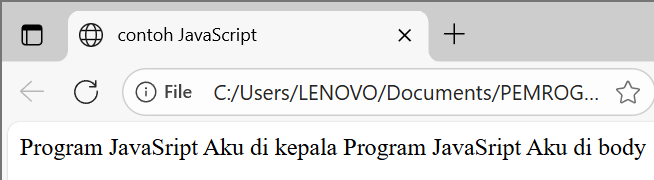

## b. Menggunakan File Eksternal
```
<SCRIPT LANGUAGE="Javascript" SRC="url/file.js"> </SCRIPT>
```
# Analisis
Kode ini digunakan untuk menjalankan JavaScript dari file eksternal.
Bagian <SCRIPT LANGUAGE="Javascript" SRC="file.js"></SCRIPT> berfungsi memanggil file bernama file.js yang berisi perintah JavaScript. Jadi alih-alih menulis kode langsung di dalam HTML, programmer bisa menyimpannya di file .js terpisah.

# outputnya 
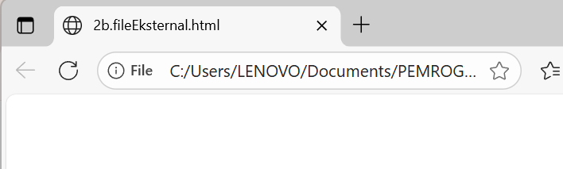

# c.event tertentu
```
<!DOCTYPE html> 
<html> 
<head> 
 <title>Belajar Javascript : Mengenal Event Pada Javascript</title> 
</head> 
<body> 
 <h1>Mengenal Event Pada Javascript</h1> 
 <h2> Perograman WEB Event one click</h2> 
  <!-- memberikan event pada element tombol --> 
 <button onclick="tampilkan_nama()">klik disini </button> 
  
 <!-- id hasil --> 
 <div id="hasil"></div> 
  
 <script>   
  // membuat function tampilkan_nama 
  function tampilkan_nama(){ 
   document.getElementById("hasil").innerHTML = 
"<h3>Nama Saya Adalah Hartika Ansar</h3>"; 
  } 
</script> 
</body> 
</html> 
```
# Analisis
Kode ini digunakan untuk memperlihatkan bagaimana event onclick bekerja di JavaScript. Awalnya halaman hanya menampilkan tombol dan sebuah <div> kosong dengan id hasil. Ketika pengguna menekan tombol, fungsi tampilkan_nama() dipanggil.

Di dalam fungsi ini, JavaScript mengambil elemen <div> dengan document.getElementById("hasil") lalu mengganti isinya dengan teks "Nama Saya Adalah Hartika Ansar". Jadi, konten halaman bisa berubah secara dinamis tanpa harus melakukan reload.
# output :
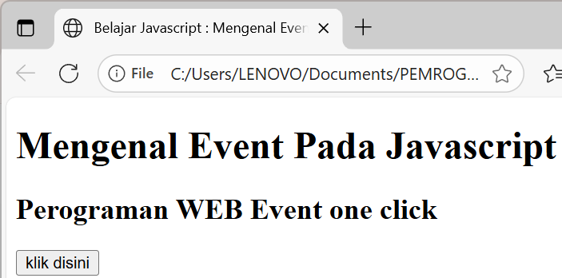

## d. contoh sederhana
```
<HTML> 
<HEAD><TITLE> contoh sederhana JavaScript</TITLE></HEAD> 
</BODY> 
<script language="JavaScript"> 
document.write("Selamat Belajar Angkatan 2019","<br>"); 
document.write("JavaScript Pemrograman WEB Teknik Komputer"); 
</script> 
</BODY> 
</HTML>
```
# Analisis
Kode ini digunakan untuk menampilkan teks secara langsung ke halaman web dengan perintah document.write(). Pada baris pertama, program mencetak kalimat "Selamat Belajar Angkatan 2019" lalu menambahkan <br> agar ada pindah baris. Setelah itu, baris kedua mencetak kalimat "JavaScript Pemrograman WEB Teknik Komputer" tepat di bawahnya.

Dari contoh ini terlihat bahwa document.write() adalah cara paling sederhana untuk menampilkan output JavaScript ke browser. Walaupun mudah, cara ini biasanya hanya dipakai untuk contoh dasar, karena di aplikasi web nyata lebih disarankan memakai manipulasi DOM (misalnya dengan innerHTML).
# output :


## 3 Masukkan data
```
<HTML> 
<HEAD> 
<TITLE>Masukan Data</TITLE> 
</HEAD> 
<BODY> 
<SCRIPT LANGUAGE = "JavaScript"> 
<!-- 
   var nama = prompt("Siapa nama Anda?"); 
   document.write("Hai, " + nama); 
//--> 
</SCRIPT> 
</BODY> 
</HTML> 
```
# Analisi
Kode ini digunakan untuk mengambil input dari pengguna menggunakan fungsi prompt(). Saat halaman dibuka, browser akan menampilkan kotak dialog dengan pesan "Siapa nama Anda?". Pengguna bisa mengetikkan namanya di dalam kotak tersebut.

Nilai yang dimasukkan kemudian disimpan dalam variabel nama. Setelah itu, document.write() menampilkan teks "Hai, [nama]" secara langsung di halaman, di mana [nama] akan diganti dengan input yang sudah diberikan.

Contoh ini memperlihatkan dasar dari interaksi antara pengguna dan JavaScript, di mana program bisa menerima data dari user dan mengolahnya untuk ditampilkan kembali.

# output :
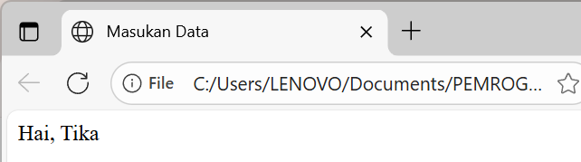

## 4. Peringatan dan Konfirmasi
```
<HTML> 
<HEAD> 
<TITLE>Alert Box</TITLE> 
</HEAD> 
<BODY> 
<SCRIPT LANGUAGE = JavaScript > 
<!--
   window.alert( ); 
//-->
</SCRIPT> 
</BODY> 
</HTML>
```
# Analisis :
Kode ini digunakan untuk menampilkan kotak pesan sederhana menggunakan window.alert(). Saat halaman dijalankan, browser akan memunculkan sebuah dialog alert, namun karena tidak ada teks yang dimasukkan ke dalam fungsi, kotak tersebut tampil kosong. Jika diisi misalnya window.alert("Selamat Datang!");, maka pesan akan muncul di dalam kotak dialog.
# output :
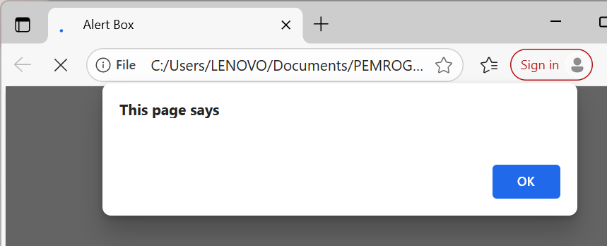

## 5. Variabel
# a. Mendeklarasikan Variabel
```
<script language="Javascript">  
<!--  
var VariabelKu;  
var VariabelKu2 = 3;  
VariabelKu = 1234;  
document.write(VariabelKu*VariabelKu2);  
// -->  
</script> 
```
# Analisis :
Kode ini digunakan untuk mendeklarasikan variabel di JavaScript, yaitu VariabelKu dan VariabelKu2. Nilai VariabelKu2 langsung diberi angka 3, sedangkan VariabelKu diisi belakangan dengan nilai 1234. Setelah itu, program menampilkan hasil perkalian dari kedua variabel dengan perintah document.write(VariabelKu * VariabelKu2), sehingga output yang muncul di browser adalah 3702.
# output :
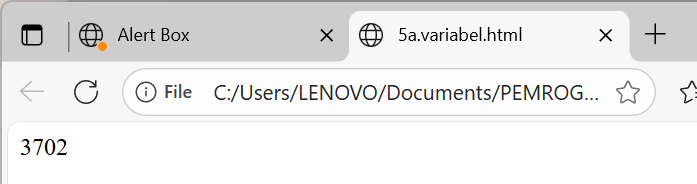

## 5. Variabel
# b. Global dan Lokal
```
<script language="JavaScript">  
var a = 12;  
var b = 4;  

function Perkalian_Dengan2(b) {  
    var hasil = b * 2;  
    return hasil;  
}  

document.write("Dua kali dari " + b + " adalah " + Perkalian_Dengan2(b) + "<br>");  
document.write("Nilai dari a adalah " + a);  
</script>
```
# Analisis :
Kode ini digunakan untuk memperlihatkan cara membuat fungsi di JavaScript. Variabel a bernilai 12 dan b bernilai 4. Lalu dibuat fungsi Perkalian_Dengan2(b) yang mengembalikan hasil perkalian parameter b dengan 2. Fungsi ini kemudian dipanggil dengan b sebagai argumen, sehingga menghasilkan 8. Output pertama menampilkan teks "Dua kali dari 4 adalah 8", sedangkan output kedua menampilkan nilai variabel a, yaitu 12.

# output :
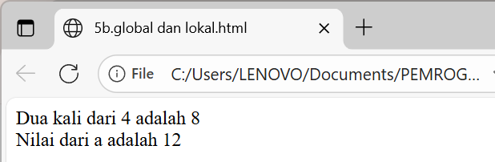

## 7. Konversi Tipe Data
```
<html> 
<head> 
<title>Konversi Bilangan</title> 
</head> 
<body> 
<script language="JavaScript"> 
var a = parseInt("27"); 
document.write("1. " + a + "<br>");

a = parseInt("27.5"); 
document.write("2. " + a + "<br>");

a = parseInt("27A"); 
document.write("3. " + a + "<br>");

a = parseInt("A27.5"); 
document.write("4. " + a + "<br>");

var b = parseFloat("27"); 
document.write("5. " + b + "<br>");

b = parseFloat("27.5"); 
document.write("6. " + b + "<br>");

b = parseFloat("27A"); 
document.write("7. " + b + "<br>");

b = parseFloat("A27.5"); 
document.write("8. " + b + "<br>");
</script> 
</body> 
</html>
```
# Analisis :
Kode ini digunakan untuk mendemonstrasikan konversi tipe data string menjadi angka menggunakan parseInt dan parseFloat di JavaScript. Pertama, parseInt digunakan untuk mengubah string menjadi bilangan bulat. Misalnya, "27" akan menjadi 27, "27.5" menjadi 27 karena parseInt hanya mengambil bagian bilangan bulat, "27A" juga menjadi 27 karena angka di depan dibaca, sedangkan "A27.5" menghasilkan NaN karena huruf di awal tidak bisa dikonversi. Selanjutnya, parseFloat digunakan untuk mengubah string menjadi bilangan desimal. "27" menjadi 27, "27.5" tetap 27.5, "27A" menjadi 27 karena angka di depan dibaca, sedangkan "A27.5" menghasilkan NaN karena huruf di awal tidak valid sebagai angka. Hasil konversi ini ditampilkan menggunakan document.write untuk tiap percobaan.
# output :
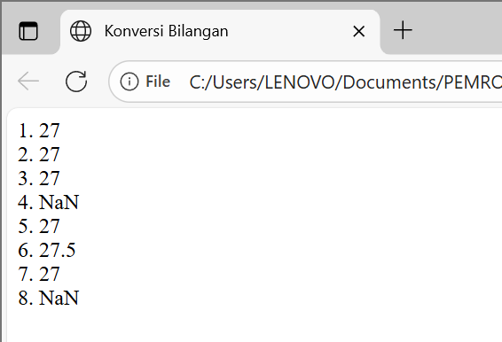

## 8. operator matematika
```
<HTML> 
<HEAD> 
<TITLE>Operasi Matematika</TITLE> 
</HEAD> 
<BODY> 
<SCRIPT LANGUAGE = "JavaScript"> 
<!-- 
document.write("2 + 3 = " + (2 + 3) ); 
document.write("<BR>"); 
document.write("20 + 3 = " + (20 - 3) ); 
document.write("<BR>"); 
document.write("20* 3 = " + (2 * 3) ); 
document.write("<BR>"); 
document.write("40 / 3 = " + (40 / 3) ); 
document.write("<BR>"); 
//--> 
</SCRIPT> 
</BODY> 
</HTML> 
```
# Analisis :
Kode ini digunakan untuk melakukan dan menampilkan operasi matematika sederhana menggunakan JavaScript. Pertama, document.write("2 + 3 = " + (2 + 3)) menampilkan hasil penjumlahan 2 + 3, yaitu 5. Baris berikutnya document.write("20 + 3 = " + (20 - 3)) menampilkan hasil pengurangan 20 - 3, yaitu 17. Selanjutnya, document.write("20* 3 = " + (2 * 3)) menampilkan hasil perkalian 2 * 3, yaitu 6. Terakhir, document.write("40 / 3 = " + (40 / 3)) menampilkan hasil pembagian 40 ÷ 3, yaitu sekitar 13.3333. Kode ini menggunakan document.write untuk menampilkan setiap hasil operasi pada halaman web, serta <BR> untuk membuat baris baru agar tampilannya rapi.
# output :
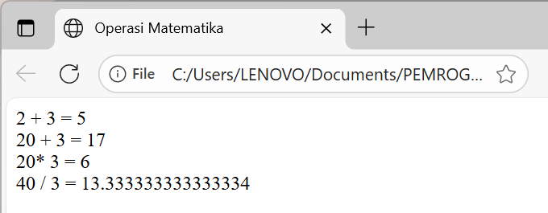

## 9. operator logika
```
<HTML> 
<HEAD> 
<TITLE>Operator ?</TITLE> 
</HEAD> 
<BODY> 
<SCRIPT LANGUAGE = "JavaScript"> 
<!-- 
var nilai = prompt("Nilai (0-100): ", 0); 
var hasil = (nilai >= 60) ? "Lulus" : "Tidak Lulus"; 
document.write("Hasil: " + hasil); 
//--> 
</SCRIPT> 
</BODY> 
</HTML>
```
# Analisis :
ode ini digunakan untuk mendemonstrasikan penggunaan operator ternary (? :) di JavaScript untuk menentukan kelulusan berdasarkan nilai yang dimasukkan pengguna. Pertama, prompt menampilkan kotak dialog agar pengguna memasukkan nilai antara 0 hingga 100, yang disimpan ke dalam variabel nilai. Kemudian, operator ternary digunakan: jika nilai >= 60, variabel hasil akan berisi "Lulus", sedangkan jika nilai < 60, hasil akan berisi "Tidak Lulus". Akhirnya, document.write menampilkan hasil penentuan kelulusan di halaman web dengan teks “Hasil: Lulus” atau “Hasil: Tidak Lulus” sesuai nilai yang dimasukkan.
# output :
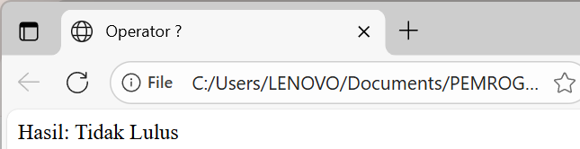

## TUGAS MANDIRI
# 1. Buatlah Script Mengkonversi Tipe Data 
```
<!DOCTYPE html>
<html lang="id">
<head>
  <meta charset="UTF-8">
  <title>Konversi Tipe Data</title>
</head>
<body>
  <h2>1. Konversi Tipe Data</h2>
  <input type="text" id="val" placeholder="Masukkan nilai">
  <button onclick="konversi()">Konversi</button>
  <p id="out"></p>

  <script>
    function konversi() {
      let val = document.getElementById("val").value;
      let num = Number(val);
      let bool = Boolean(val);
      let str = val.toString();
      let ch = val.length > 0 ? val.charAt(0) : "(kosong)";
      document.getElementById("out").innerHTML =
        "String → Number: " + num + "<br>" +
        "String → Boolean: " + bool + "<br>" +
        "Value → String: " + str + "<br>" +
        "String → Char: " + ch;
    }
  </script>
</body>
</html>
```
# Analisis :
Kode HTML dan JavaScript ini digunakan untuk mendemonstrasikan konversi tipe data dari string ke tipe data lain di JavaScript. Pengguna dapat memasukkan nilai ke dalam kotak teks, kemudian menekan tombol “Konversi” untuk memproses nilai tersebut. Fungsi konversi() akan mengambil nilai dari input, lalu mengubahnya menjadi beberapa tipe data: Number untuk konversi ke angka, Boolean untuk konversi ke nilai benar/salah, dan String untuk memastikan nilainya berupa string.

Selain itu, kode ini juga mengekstrak karakter pertama dari string menggunakan charAt(0), dan jika input kosong, akan menampilkan teks “(kosong)”. Hasil dari setiap konversi kemudian ditampilkan di paragraf <p> dengan innerHTML, sehingga pengguna dapat melihat secara langsung bagaimana nilai input berubah ke tipe data lain dan karakter pertamanya. Kode ini membantu memahami cara konversi tipe data dasar di JavaScript.
# output :


# 2. Buatlah Script menggunakan Tipe data dalam Array. 
```
<!DOCTYPE html>
<html lang="id">
<head>
  <meta charset="UTF-8">
  <title>Array</title>
</head>
<body>
  <h2>2. Contoh Array</h2>
  <button onclick="tampilkan()">Tampilkan Array</button>
  <p id="hasil"></p>

  <script>
    function tampilkan() {
      let buah = ["Apel", "Jeruk", "Mangga", "Pisang"];
      let angka = [10, 20, 30, 40];
      let campur = ["Tika", 22, true, 3.14];

      document.getElementById("hasil").innerHTML =
        "Array Buah: " + buah.join(", ") + "<br>" +
        "Array Angka: " + angka.join(", ") + "<br>" +
        "Array Campuran: " + campur.join(", ");
    }
  </script>
</body>
</html>
```
# Analisis :
Kode HTML dan JavaScript ini digunakan untuk mendemonstrasikan penggunaan array di JavaScript. Ketika pengguna menekan tombol “Tampilkan Array”, fungsi tampilkan() akan dijalankan. Di dalam fungsi tersebut, terdapat tiga array: buah yang berisi daftar nama buah, angka yang berisi beberapa angka, dan campur yang berisi berbagai tipe data seperti string, angka, boolean, dan float.

Fungsi ini kemudian menampilkan isi ketiga array di halaman web menggunakan document.getElementById("hasil").innerHTML. Metode join(", ") digunakan agar setiap elemen array dipisahkan dengan koma dan spasi, sehingga hasil tampilannya rapi dan mudah dibaca. Kode ini membantu memahami bagaimana membuat, menyimpan, dan menampilkan array dengan berbagai tipe data di JavaScript.
# output :
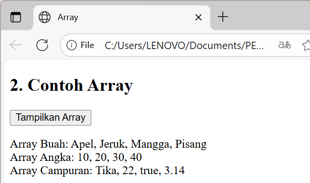

# 3. Buatlah calculator sederhana pada menggunakan java script, menggunakan texfield dan tombol 
# Analisi :
Kode HTML dan JavaScript ini digunakan untuk membuat kalkulator sederhana yang dapat melakukan operasi penjumlahan, pengurangan, perkalian, dan pembagian. Pengguna memasukkan dua angka ke dalam input angka1 dan angka2, kemudian menekan tombol operasi yang diinginkan (+, -, *, atau /). Fungsi hitung(op) akan mengambil nilai dari kedua input, mengubahnya menjadi angka desimal menggunakan parseFloat, dan menyimpan hasil perhitungan ke variabel res sesuai operator yang dipilih.

Setelah perhitungan selesai, hasil ditampilkan di halaman web melalui document.getElementById("hasil").innerHTML. Struktur kode ini memungkinkan pengguna untuk melakukan berbagai operasi matematika sederhana secara interaktif, sekaligus memperlihatkan cara penggunaan kondisi if-else untuk memilih jenis operasi berdasarkan tombol yang ditekan. Kode ini juga membantu memahami konsep pengambilan input, konversi tipe data, dan manipulasi DOM di JavaScript.
# output :
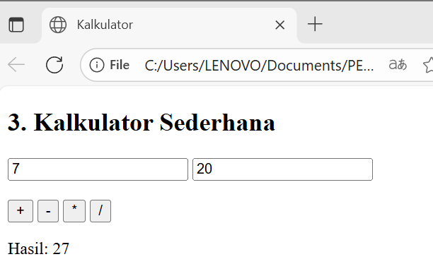

# 4. Buatlah minimal 3 hitungan menggunakan java script menggunakan rumus bangun ruang. 
# Analisis :
Kode HTML dan JavaScript ini digunakan untuk menghitung volume beberapa bangun ruang, yaitu kubus, balok, dan bola. Untuk kubus, pengguna memasukkan panjang sisi, kemudian fungsi kubus() menghitung volume dengan rumus sisi × sisi × sisi dan menampilkannya di halaman. Untuk balok, pengguna memasukkan panjang, lebar, dan tinggi, kemudian fungsi balok() menghitung volume dengan rumus panjang × lebar × tinggi dan menampilkannya.

Untuk bola, pengguna memasukkan jari-jari, lalu fungsi bola() menghitung volume menggunakan rumus (4/3) × π × r³ dengan Math.PI untuk π dan Math.pow untuk pangkat tiga. Hasil perhitungan bola dibulatkan dua angka desimal menggunakan toFixed(2) sebelum ditampilkan. Kode ini menunjukkan cara membuat interaksi input pengguna, menghitung nilai dengan rumus matematika, dan menampilkan hasil secara langsung di halaman web menggunakan JavaScript.
# output :
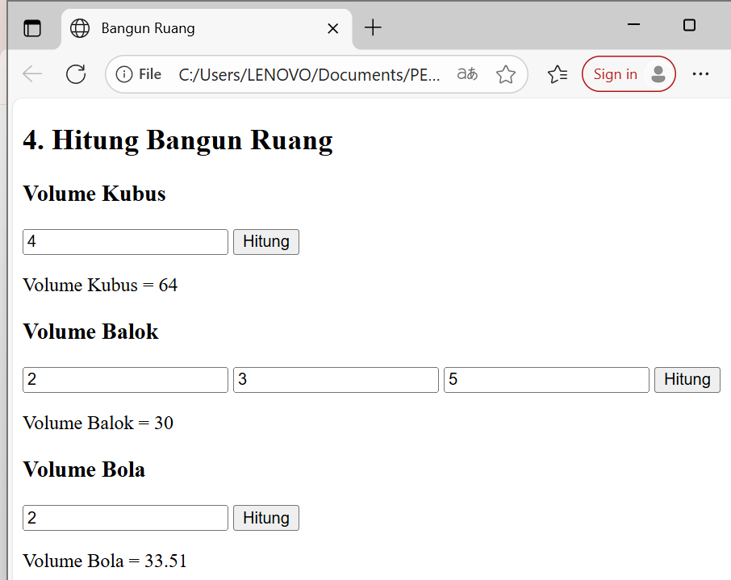
